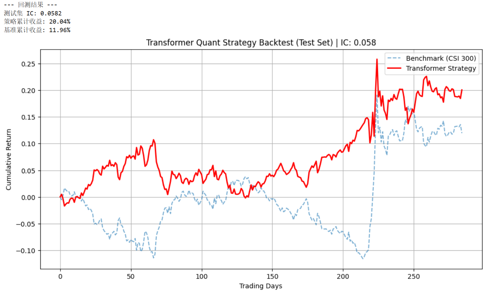

# Transformer-Based Quantitative Stock Selection Strategy

[](https://www.python.org/)
[](https://pytorch.org/)
[](LICENSE)

## Project Overview
This project implements a deep learning-based quantitative trading strategy focusing on the **CSI 300 Index (沪深300)**. 

Addressing the limitations of traditional linear multi-factor models, this framework leverages the **Transformer Encoder** architecture with **Multi-head Attention** mechanisms. It is designed to capture long-term temporal dependencies in financial time series data and mine non-linear alpha factors effectively.

##  Key Performance (Out-of-Sample)
The strategy was backtested on unseen data, demonstrating strong predictive power compared to the benchmark.

| Metric | Value |
| :--- | :--- |
| **Information Coefficient (IC)** | **0.0582** |
| **Strategy Cumulative Return** | **20.04%** |
| **Benchmark (CSI 300) Return** | 11.96% |
| **Excess Return (Alpha)** | +8.08% |

### Backtest Visualization

*(Figure: Cumulative return comparison. Red: Transformer Strategy; Blue: Benchmark)*

## 🛠 Technical Architecture

### 1. Data Engineering (ETL)
* **Source**: Tushare Pro API (Daily frequency).
* **Preprocessing**: 
    * Rolling window sequences generation (`Seq_Len=20`).
    * **Z-Score Normalization** to handle different scales of factors.
    * Label generation using T+1 daily returns.

### 2. Feature Engineering
Constructed 6 core technical factors to feed the neural network:
* **Trend**: MACD, Momentum (10-day).
* **Volatility**: 5-day Rolling Volatility.
* **Oscillator**: RSI (Relative Strength Index).
* **Price Action**: Daily percentage change.

### 3. Model Architecture (PyTorch)
* **Embedding Layer**: Maps technical factors to high-dimensional vector space.
* **Positional Encoding**: Preserves the sequential order of time-series data.
* **Transformer Encoder**: 
    * 2 Encoder Layers.
    * 4 Attention Heads (`nhead=4`) to capture diverse market regimes.
    * `d_model=64`, `Dropout=0.1`.
* **Decoder**: Linear layer for regression output (predicting next-day return).

## Quick Start

### Prerequisites
* Python 3.8+
* Tushare Token (Get one at [Tushare.pro](https://tushare.pro/))

### Installation
1.  **Clone the repository**
    ```bash
    git clone [https://github.com/YOUR_USERNAME/Transformer-Quant-Strategy.git](https://github.com/YOUR_USERNAME/Transformer-Quant-Strategy.git)
    cd Transformer-Quant-Strategy
    ```

2.  **Install dependencies**
    ```bash
    pip install pandas numpy matplotlib scikit-learn torch tushare
    ```

3.  **Configure Token**
    Open `main.py` and replace the placeholder with your Tushare token:
    ```python
    class Config:
        tushare_token = 'YOUR_REAL_TOKEN_HERE' 
    ```

4.  **Run the Strategy**
    ```bash
    python main.py
    ```

## Disclaimer
This project is for **research and educational purposes only**. It does not constitute investment advice. Quantitative trading involves substantial risks.

---
*Created by Zhipeng Li*
